$\boldsymbol{}$
$\color{green} \text {} $

- **深度学习**
    - **网路结构**
        - ***MLP* （全连接）**
        - ***CNN*** 
        - ***RNN***
        - ***DBN (Deep Belief Network) ==TODO==***
        - ***GAN***
    - **激活函数**
        - ***Sigmoid***
            - $\boldsymbol{S(x)=\frac{1}{1+e^{-x}}}$
            - **易于求导**
            - **但反传时易“梯度消失”**
        - ***tanh***
            - $\boldsymbol{\tanh(x) = \frac{e^{x} - e^{-x}}{e^{x} + e^{-x}}}$
            - **均值为0，更快收敛**
            - **但反传时易“梯度消失”**
        - ***ReLU (Rectified Linear Unit)***
            - $\boldsymbol{ReLU(x) = max(0, x)}$
            - ***Leakly ReLU***
                - $\boldsymbol{f(x) = \begin{cases}x & \quad x>0 \\\lambda x & \quad x \leqslant 0 \end{cases}; \lambda\in(0,1)}$
            - ***RReLU (Randomized leaky ReLU)***
                - $\boldsymbol{f(x) = \begin{cases}x & \quad x>0 \\\lambda x & \quad x \leqslant 0 \end{cases}; \lambda\sim\mathrm{U}(l,u), l<u, l,u\in[0,1)}$
            - ***Noisy ReLU***
                - $\boldsymbol{f(x) =\max(0,x+Y); Y\sim\mathrm{N}(0,\sigma(x))}$
        - 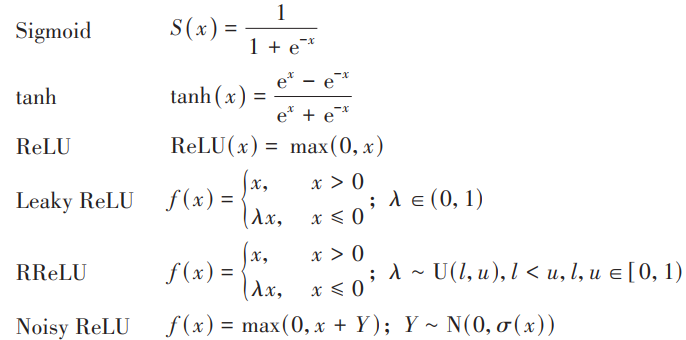
    - **损失函数**
        - ***CrossEntropy***
        - ***MSE (Mean-Square Error)*损失函数**
        - ***log* 损失函数**
        - **指数损失函数**
            - ***Adaboost***
        - ***Hinge* 损失函数**
            - 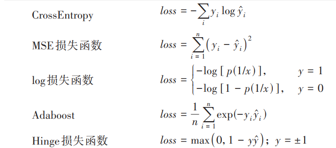
    - **模型复杂度**
        - $\color{green} \text {Why should I trust you? Explaining the predictions of any classifier} $
    - **可解释性定义**
        - **2017, Kim, *"Interpretation is the process of giving explanations to Human"***
            - $\color{green} \text {Interpretable machine learning: the fuss，the concrete and the questions} $
        - **Doshi-Velez, *"Interpretability is the ability to explain or to present in understandable terms to a human"***
            - $\color{green} \text {Towards a rigorous science of interpretable machine learning} $
        - **Miller**
            - $\color{green} \text {Explanation in artificial intelligence: insights from the social sciences} $
        - **Molnar**
            - $\color{green} \text {A Guide for Making Black Box Models Explainable} $
    - **可解释性方法**
        - **事前(ante-hoc)可解释性**
            - 通过**训练结构简单、可解释性好的模型或将可解释性结合到具体的模型结构中的自解释模型使模型本身具备可解释能力**
            - **模型本身内置可解释性**
            - $\color{green} \text {Towards robust interpretability with self-explaining neural networks} $
            - **自解释模型 ==TODO==**
                - **模型整体的可模拟性(simulatability)**
                    - **模型透明**
                        - **整体上完全理解**
                        - 将**输入数据连同模型的参数**一起，在**合理的时间**步骤**内**完成产生**预测所需的每一个计算**
                - **模型单个组件的可分解性(decomposability)**
                    - $\color{green} \text {Intelligible models for classification and regression} $
                    - **模型的每个部分**，包括**模型结构、模型参数**，模型的**每一个输入以及每一维特征**都允许**直观的解释**
                - **内置可解释性与模型准确性的矛盾**
                - $\color{green} \text {A survey of methods for explaining black box models} $
                - $\color{green} \text {Simplifying decision trees: A survey} $
                - 对于决策树模型和基于规则的模型，**如果树深度太深或者模型的规则太复杂**，人类**也未必能理解**
            - **广义加性模型(GAM) ==TODO==**
                - $\color{green} \text {Intelligible models for classification and regression} $
                - $\color{green} \text {Statistical Models in S} $
                - $\color{green} \text {Generalized additive models: An introduction with R} $
                - 既能**提高简单线性模型的准确率**，又能**保留线性模型良好的内置可解释性**
                - $\boldsymbol{g\left(y\right)=f_1\left(x_1\right)+f_2\left(x_2\right)+\cdotp\cdotp\cdotp+f_n\left(x_n\right)}$
                    - $\boldsymbol{f_{i}\left(\cdot\right)}$ **: 单特征模型(single-feature) 、特征** $\boldsymbol{x_i}$ **对应的形函数(shape function)**
                        - **可能非线性、复杂**
                - **消除特征间的相互作用 ==(Disentangled representation ？)==**
                - **Lou, 基于有限大小的梯度提升树加性模型方法**
                    - $\color{green} \text {Intelligible models for classification and regression} $
                - **Ravikumar, 稀疏加性模型的高维非参数回归分类方法**
                    - $\color{green} \text {Sparse additive models} $
                    - **结合稀疏线性建模和加性非参数回归**
                    - **解决了高维空间中加性模型的拟合问题**
                    - **基于** $\boldsymbol{l_1}$ **正则的稀疏性，可实现特征的有效选择**
                - **Poulin, 加性模型的图形化解释**
                    - $\color{green} \text {Visual explanation of evidence with additive classifiers} $
            - **注意力机制(Attention Mechanism) ==TODO==**
                - $\color{green} \text {Neural machine translation by jointly learning to align and translate} $
                - $\color{green} \text {Attention is all you need} $
                - $\color{green} \text {Retain: An interpretable predictive model for healthcare using reverse time attention mechanism} $
                - 神经网络模型由于**模型结构复杂、算法透明性低**，因此**神经网络**模型的**自身可解释性只能**通过**额外引入可解释性模块 ==(只能？)==**
                - **注意力机制具有良好的可解释性**
                    - **注意力权重矩阵直接体现**了**模型在决策过程中感兴趣的区域**
                - **NLP**
                    - **Bahdanau, AM结合ED**
                        - $\color{green} \text {Neural machine translation by jointly learning to align and translate} $
                        - **En**
                            - **双向循环神经网络(Bi-RNN)将源语言编码到向量空间中**
                        - **De**
                            - **AM**为**解码器的隐藏状态分配不同的权重**
                            - **选择性地处理输入句子的不同部分**
                                - 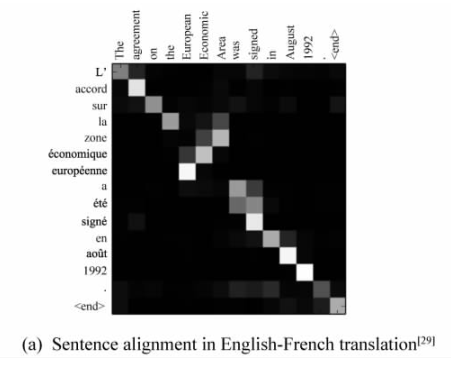
                    - **Yang, 引入Hierarchical AM (HAM) 分层注意力机制到文本分类任务**
                        - $\color{green} \text {Hierarchical attention networks for document classification} $
                        - **注意力权重量化了每一个词的重要性**
                            - 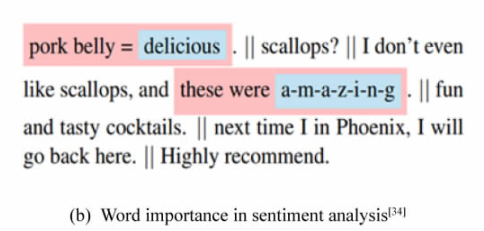
                - **CV**
                    - **Xu, *AM*用于看图说话(image caption)产生图片的描述**
                        - $\color{green} \text {Show, attend and tell: Neural image caption generation with visual attention} $
                        - **CNN提取特征**
                        - **带AM的RNN生成描述**
                        - **注意力实现了单词与图片之间的对齐**
                            - **可视化注意力权重矩阵**
                                - 模型在**生成每一个单词**时所**对应的感兴趣的图片区域**
                                    - 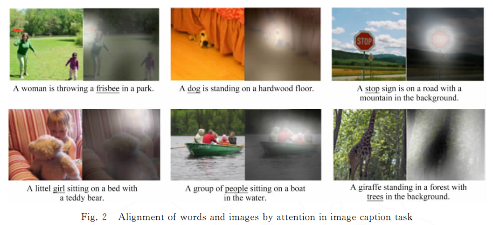
                - **Recommender System**
                    - $\color{green} \text {NAIS: Neural attentive item similarity model for recommendation} $
                    - $\color{green} \text {Sequential recommender system based on hierarchical attention networks} $
                    - $\color{green} \text {ATRank: An attention-based user behavior modeling framework for recommendation} $
                    - $\color{green} \text {NAIRS: A Neural Attentive Interpretable Recommendation System} $
                    - $\color{green} \text {Interpretable convolutional neural networks with dual local and global attention for review rating prediction} $
        - **事后(post-hoc)可解释性**
            - 通过**开发可解释性技术解释已训练好的机器学习模型**
                - 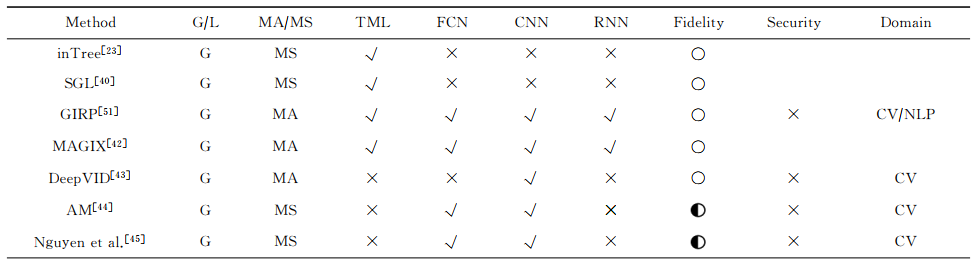
                - 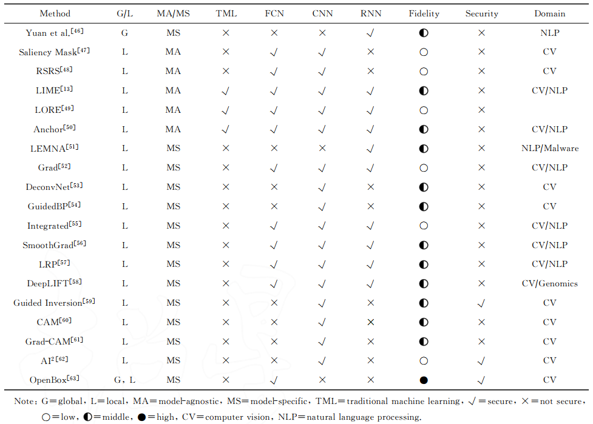
            - **全局可解释性(global interpretability)**
                - $\color{green} \text {A survey of methods for explaining black box models} $
                - 理解复杂模型背后的**整体逻辑以及内部的工作机制**
                - **规则提取 ==TODO==**
                    - **利用可理解的规则集合生成可解释的符号描述，或从中提取可解释模(如决策树、基于规则的模型等)**，使之具有**与原模型相当的决策能力**
                    - $\color{green} \text {Survey and critique of techniques for extracting rules from trained artificial neural networks} $
                    - $\color{green} \text {The truth will come to light: Directions and challenges in extracting the knowledge embedded within trained artificial neural networks} $
                    - $\color{green} \text {DEDEC: A methodology for extracting rules from trained artificial neural networks} $
                    - $\color{green} \text {Rule generation from neural networks} $
                    - **针对树融合(tree ensemble)模型**
                        - $\color{green} \text {Interpreting tree ensembles within trees} $
                        - $\color{green} \text {Rule extraction from decision trees ensembles: New algorithms based on heuristic search and sparse group lasso methods} $
                        - $\color{green} \text {Rule extraction from random forest: The RF+HC methods} $
                        - $\color{green} \text {Making tree ensembles interpretable: A Bayesian model selection approach} $
                        - $\color{green} \text {Making tree ensembles interpretable} $
                        - 一个集成的树模型**通常由多个决策树构成**
                            - **每棵树**的**根节点到叶子节点**的**每一条路径**
                                - **一条决策规则**
                            - **每一棵决策树中提取的规则进行组合**
                        - 基于**规则长度、规则频率、误差等**指标**对提取的规则进行排序**
                            - **规则长度**
                                - **规则的复杂度**
                            - **规则频率**
                                - **满足规则的数据实例的比例**
                            - **误差**
                                - **规则的决策能力**
                        - **基于排序结果**，**对**规则中的**无关项和冗余项**进行**剪枝**并**选择**一组相关的**非冗余规则**
                    - **针对神经网络模型 ==TODO==**
                        - **分解法(decompositional method)**
                            - $\color{green} \text {Global model interpretation via recursive partitioning} $
                            - $\color{green} \text {A systematic method for decompositional rule extraction from neural networks} $
                            - $\color{green} \text {Decompositional rules extraction methods from neural networks} $
                            - **要求神经网络透明**
                            - 注重从受训神经网络中**提取单个单元(如隐含单元、输出单元)层次上规则 ==(Disentangled representation ？)==**
                            - **每一个隐含单元和输出单元的计算结果**都能映射成一个**对应于一条规则的二进制结果**
                                - 每一个**隐含单元或输出单元**都可以被解释为**一个阶跃函数或一条布尔规则**
                        - **教学法(pedagogical method)**
                            - $\color{green} \text {Using sampling and queries to extract rules from trained neural networks} $
                            - $\color{green} \text {Extracting symbolic rules from trained neural network ensembles} $
                            - $\color{green} \text {Active learning-based pedagogical rule extraction} $
                            - **神经网络视为黑盒**
                                - $\color{green} \text {MAGIX: Model agnostic globally interpretable explanations} $
                                - $\color{green} \text {Interpretable and explorable approximations of black box models} $
                                - **只能操纵**模型的**输入和输出**
                            - 提取将**输入直接映射到输出的规则**
                                - **结合符号学习算法**
                                - 利用**受训神经网络来为学习算法生成样本**，最后**从生成的样例中提取规则**
                    - **不够精确，只能提供近似解释，可解释性的质量受规则本身复杂度的制约**
                - **模型蒸馏 (Knowledge Distillation) ==TODO==**
                    - $\color{green} \text {Improving the interpretability of deep neural networks with knowledge distillation} $
                    - $\color{green} \text {Model compression} $
                    - **降低模型复杂度**
                    - **结构紧凑的学生模型(student model)作为结构复杂的教师模型(teacher model)的全局近似**
                        - **如何保留学习到的知识和泛化能力**
                        - **学生模型用可解释性好的模型(线性模型、决策树、广义加性模型以及浅层神经网络等)**
                            - **Hinton, 知识蒸馏**
                                - $\color{green} \text {Distilling the knowledge in a neural network} $
                                - **软目标辅助硬目标训练学生模型**
                                    - **软目标**
                                        - **教师模型的分类概率值**
                                        - 包含的**信息量大**，体现了**不同类别之间相关关系**的信息
                                    - **硬目标**
                                        - **原始数据的类别信息**
                                - **教师模型生成软目标，最小化软目标和硬目标的联合损失函数** $\boldsymbol{L_\text{stdudent}{ = }\alpha L^{\text{(soft)}} + (1- \alpha)L^{\text{(hard)}}}$ 来**训练学生模型**
                                    - $\boldsymbol{L^{\text{(soft)}}}$
                                        - **软目标损失**
                                        - **要求学生模型生成的软目标**与**教师模型生成的软目标**要**尽可能的接近**，保证学生模型能**有效地学习教师模型中的暗知识(dark knowledge)**
                                    - $\boldsymbol{L^{\text{(hard)}}}$
                                        - **硬目标损失**
                                        - **要求学生模型**能够**保留**教师模型**良好的决策性能**
                            - **Frosst, 决策树模拟**
                                - $\color{green} \text {Distilling a neural network into a soft decision tree} $
                            - **Tan, GAM模拟**
                                - $\color{green} \text {Learning global additive explanations for neural nets using model distillation} $
                                - 提出利用KD来学习**描述输入特征与复杂模型的预测**之间**关系**的**全局加性模型**，并**基于加性模型**对复杂模型进行**全局解释**
                            - **Che, 模型蒸馏的可解释方法应用于医疗诊断模型**
                                - $\color{green} \text {Interpretable deep models for ICU outcome prediction} $
                                - **梯度提升树**进行知识蒸馏的方式来**学习可解释模型**
                                - 在**急性肺损伤**病人**无呼吸机天数预测**任务中效果优异
                            - **Xu, *Darksight* ==TODO==**
                                - $\color{green} \text {Interpreting deep classifier by visual distillation of dark knowledge} $
                                - **模型蒸馏**从**黑盒模型**中**提取暗知识**，并以**可视化**的形式对提取的**暗知识**进行呈现
                    - **实现简单，易于理解**，且不依赖待解释模型的具体结构信息，因而作为一种**模型无关**的解释方法，常被用于解释黑盒机器学习模型
                    - 蒸馏模型**只是**对原始复杂模型的**一种全局近似**，它们之间始终存在差距．因此，基于蒸馏模型所做出的解释**不一定能反映**待解释模型的**真实行为**．此外，**知识蒸馏过程通常不可控**，**无法保障**待解释模型从海量数据中**学到的知识有效地迁移到蒸馏模型**中，因而导致解释结果**质量较低**无法满足精确解释的需要
                - **激活最大化 (activation maximization, AM)**
                    - 考虑到**数据集**中**存在偏差**，**模型精度无法保证模型表征的可靠性**，也**无法确定 DNN** 用于**预测**的**内部工作模式**
                        - $\color{green} \text {Examining CNN representations with respect to dataset bias} $
                    - **DNN中每一个隐含层的神经元所捕获的表征**
                        - $\color{green} \text {Interpretable convolutional neural networks} $
                    - 在**特定的层**上找到**神经元的首选输入最大化神经元激活**
                    - 通过寻找**有界范数的输入模式**，**最大限度**地**激活**给定的**隐藏单元**
                        - **一个单元最大限度地响应的输入模式可能**是一个单元**正在做什么的良好的一阶表示**
                        - $\color{green} \text {Visualizing higher-layer features of a deep network} $
                        - $\color{green} \text {On the analysis and interpretation of inhomogeneous quadratic forms as receptive fields} $
                        - $\color{green} \text {Methods for interpreting and understanding deep neural networks} $
                        - **可定义为优化问题: $\boldsymbol{x^{*}=\arg\max_{x}(f_{l}(x)-\lambda\left\|x\right\|^{2})}$**
                            - $\boldsymbol{f_{l}\left(x\right)}$
                                - **DNN第** $\boldsymbol{l}$ **层某一个神经元**在**当前输入** $\boldsymbol{x}$ 下的**激活值**
                            - $\boldsymbol{\lambda\left\|x\right\|^{2}}$
                                - $\boldsymbol{l_2}$ **正则**
                            - **通过梯度上升求解**
                            - **可视化生成的原型样本** $\boldsymbol{x^{*}}$ 
                    - **虽然原理简单，但实际不易实现**
                        - **样本搜索空间很大**
                            - **优化过程可能产生含有噪声和高频模式的不现实图像**
                                - **难以理解**
                    - **故必须采用 ==自然图像先验约束（？）==**
                    - **人工构造先验**
                        - $\color{green} \text {Understanding deep image representations by inverting them} $
                        - $\color{green} \text {Plug and play generative networks: Conditional iterative generation of images in latent space} $
                        - $\boldsymbol{\alpha}$ **范数**
                        - **高斯模糊**
                    - **Nguyen, 生成对抗网络结合激活最大化生成原型样本**
                        - $\color{green} \text {Synthesizing the preferred inputs for neurons in neural networks via deep generator networks} $
                        - **优化问题重定义：**$\boldsymbol{z^*=\arg\max_{z\in Z}(f_l(g(z))-\lambda\left\|z\right\|^2)}$ 
                            - $\boldsymbol{f_l(g(z))}$
                                - **解码器与原神经元激活值的结合**
                        - **不直接优化图像**，转而**优化代码空间**以找到可以**最大化神经元激活的解** $\boldsymbol{z^*}$ 
                        - **解码得到原型样本** $\boldsymbol{x^* = g\left(z^*\right)}$ 
                            - 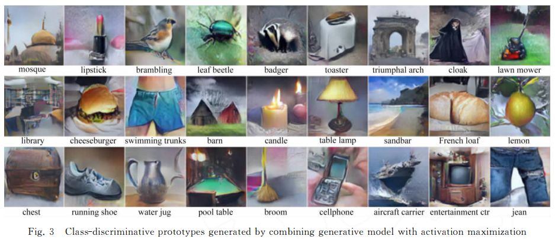
                    - **模型相关，解释结果更准确，可视化易于理解**
                    - **优化过程中**的**噪音和不确定性可能导致**产生的**原型样本难以解释**
                        - 虽然**构造自然图像先验约束优化过程**可以**解决**，**但**如何构造更好的**自然图像先验本身**就是一大**难题**
                    - **只能用于优化连续性数据**，**无法直接应用于**诸如**文本、图数据**等离散型数据
            - **局部可解释性(local interpretability)**
                - $\color{green} \text {How to explain individual classification decisions} $
                - 理解机器学习模型**针对每一个输入样本的决策过程和决策依据**
                - **以输入样本为导向**
                - 通常通过分析**输入样本**的**每一维特征对**模型**最终决策**结果**的贡献**来实现
                    - **敏感性分析**
                        - $\color{green} \text {Sensitivity Analysis in Practice: A Guide to Assessing Scientific Models} $
                        - $\color{green} \text {Sensitivity Analysis in Linear Regression} $
                        - $\color{green} \text {Importance measures in global sensitivity analysis of nonlinear models} $
                        - $\color{green} \text {A quantitative model-independent method for global sensitivity analysis of model output} $
                        - $\color{green} \text {Determining the significance of input parameters using sensitivity analysis} $
                        - $\color{green} \text {Sensitivity analysis applied to artificial neural networks: What has my neural network actually learned?} $
                        - $\color{green} \text {Ranking importance of input parameters of neural networks} $
                        - **给定假设**下，**定量分析相关自变量**发生某种**变化对**某一**特定因变量**的**影响程度**
                        - **模型相关**
                            - **局部梯度信息**评估**特征与决策结果的相关性**
                            - **相关性：**$\boldsymbol{R_i\left(x\right)=\left(\frac{\partial f\left(x\right)}{\partial x_i}\right)^2}$ 
                                - $\boldsymbol{f(x)}$ 
                                    - **决策函数**
                                - $\boldsymbol{x_i}$ 
                                    - **待解释样本** $\boldsymbol{x}$ 的**第** $\boldsymbol{i}$ **维特征**
                                - $\boldsymbol{R_i\left(x\right)}$ 
                                    - 可看作**模型梯度的** $\boldsymbol{l_2}$ **范数的分解**
                                        - $\boldsymbol{\sum_{i=1}^dR_i(x) = \parallel\nabla f(x)\parallel^{2}}$ 
                            - $\boldsymbol{R_i\left(x\right)}$ **可通过梯度反传求解**
                        - **模型无关**
                            - **待解释模型可看作黑盒，无需模型梯度信息，只关注待解释样本特征值变化对模型最终决策的影响**
                            - **Robnik-Sikonja**
                                - $\color{green} \text {Explaining classifications for individual instances} $
                                - **分解输入样本单个属性值的预测**的方式来观察属性值**对**该样本**预测结果的影响**
                                - $\boldsymbol{R_i(x)=f(x)-f(x\backslash x_{i})}$ 
                            - **Liu, 限制支持域集**
                                - $\color{green} \text {What has my classifier learned? Visualizing the classification rules of bag-of-feature model by support region detection} $
                                - **限制支持域集**
                                    - 一组受**大小限制**且**不重叠**的**区域**
                                    - **删除任何一个区域**将会**导致**模型**分类出错**
                            - **Fong, 基于有意义扰动的敏感性分析方法**
                                - $\color{green} \text {Interpretable explanations of black boxes by meaningful perturbation} $
                                - **添加扰动或删除**待解释图片的**不同区域**
                                    - **最小化**模型目标类别**分类概率**的方式**学习**一个**显著性掩码**
                                        - 识别对模型决策**结果影响最大的图像部分**
                                        - **可视化显著性掩码**
                                            - 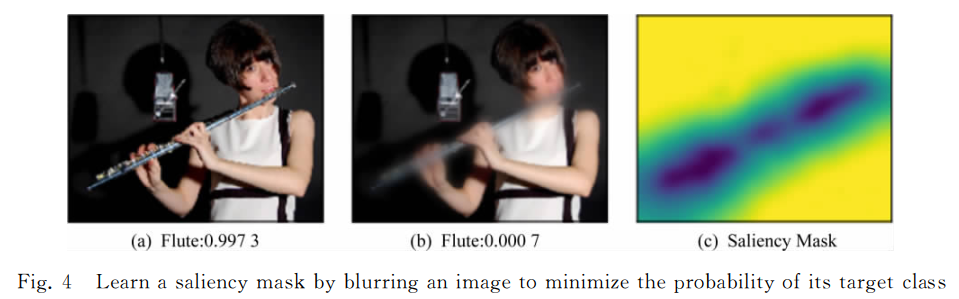
                            - **Li**
                                - $\color{green} \text {Understanding neural networks through representation erasure} $
                                - 观察**修改或删除特征子集**前后模型**决策结果**的相应**变化**的方式来**推断**待解释样本的**决策特征**
                            - **解释的是决策函数** $\boldsymbol{f(x)}$ **局部变化对决策结果的影响，而不是决策函数本身**
                            - **只能**捕获**单个特征对**最终决策**结果**的**影响程度**
                                - **相关性分值** $\boldsymbol{R_i\left(x\right)}$ 对应的**热力图**在**空间上**是**离散**而不连续的
                            - **解释结果**通常**相对粗糙**且**难以理解，无法解释特征之间的相关关系对**最终决策**结果的影响**
                    - **局部近似**
                        - 给定一个输入实例，模型针对**该实例以及该实例邻域内样本的决策边界可以通过可解释的白盒模型来近似**
                        - **Ribeiro, *LIME* ==TODO==**
                            - $\color{green} \text {Why should I trust you? Explaining the predictions of any classifier} $
                            - **神经网络的局部线性假设**
                                - 在整个数据空间中，待解释模型的**决策边界可以任意的复杂**，**但**模型**针对某一特定实例**的**决策边界通常**是**简单**的，**甚至**是**近线性**的
                            - 利用**该实例以及一组近邻训练**一个**回归模型来拟合待解释模型的局部边界**
                                - **线性模型**的**权重系数**直接体现了**当前决策**中**该实例**的**每一维特征重要性**
                        - **Guidotti, *LORE***, 适用于**关系表数据**的基于**局部规则**的**黑盒模型决策结果解释方法**
                            - $\color{green} \text {Local rule-based explanations of black box decision systems} $
                            - **二分类模型** $\boldsymbol{f}$ **，由** $\boldsymbol{f}$ **标记的实例** $\boldsymbol{x}$ 
                            - ***ad-hoc* 遗传算法生成给定实例** $\boldsymbol{x}$ 的**一组平衡邻居实例**来**构建**一个**简单**的、**可解释**的**预测模型，逼近针对实例** $\boldsymbol{x}$ **的决策边界**
                            - 从**生成的实例**集合**中提取一个决策树模型，并提取规则作为实例** $\boldsymbol{x}$ **分类结果的局部解释**
                        - **Ribeiro, *Anchor* ==TODO==**
                            - $\color{green} \text {Anchors: High-precision model-agnostic explanations} $
                            - $\color{green} \text {Nothing else matters: Model-agnostic explanations by identifying prediction invariance} $
                            - ***if-then* 规则**来**逼近**待解释模型的**局部边界**
                            - **直观、易于理解**，而且**解释覆盖范围清晰**
                        - ***LIME*, *LORE*, *Anchor***, 需**假设输入样本特征相互独立，无法准确解释 *RNN* 等**
                        - **Guo, *LEMNA***
                            - $\color{green} \text {Lemna: Explaining deep learning based security applications} $
                            - **假设**待解释模型的**局部边界**是**非线性**的
                            - **训练混合回归模型**，**保证解释**的**保真度**
                            - 引入**融合 *(Fused) Lasso* 正则处理 *RNN* 特征依赖**问题
                        - **实现简单、易于理解、不依赖模型具体结构**
                        - **只是局部近似，无法解释整体决策**
                        - 对于**不同的输入实例**，需要**重新训练**模型拟合，**效率不高**
                        - **需要**待解释实例的**特征相互独立**，**无法解释特征之间相关关系**
                    - **反向传播 (back propagation, BP)**
                        - **Simonyan, *Grad***, **利用反向传播推断特征重要性**
                            - $\color{green} \text {Deep inside convolutional networks: Visualising image classification models and saliency maps} $
                            - 利用 ***BP* 计算**模型的**输出相对于输入**图片的**梯度**来求解该输入图片所对应的**分类显著图(Saliency Map)**
                        - **Zeiler, *DeconvNet***, **反卷积网络**
                            - $\color{green} \text {Visualizing and understanding convolutional networks} $
                            - 反向传播一个重要信号时，**当且仅当信号值为负**，**进入 ReLU 的重要信号被置零**，而不**考虑前向传播**过程中**输入到 ReLU 的信号的符号**
                        - **Springenberg, *GuidedBP***, **结合 *Grad* 和 *DeconvNet***
                            - $\color{green} \text {Striving for simplicity: The all convolutional net} $
                            - **丢弃负值**来**修改 ReLU 函数梯度**
                        - **Sundararajan, *Integrated***, **集成梯度方法 ==TODO==**
                            - $\color{green} \text {Gradients of counterfactuals} $
                            - **计算输入从某些起始值按比例放大到当前值的梯度的积分代替单一梯度**
                            - **有效解决 DNN 神经元饱和**
                                - **DNN 神经元饱和: 梯度信息无法反映特征重要性**
                        - **==以上4种得到的显著图通常包含很多视觉可见的噪音==**
                            - **无法确定**这种**噪音是否真实反映**了模型在分类过程中的**决策依据**
                                - 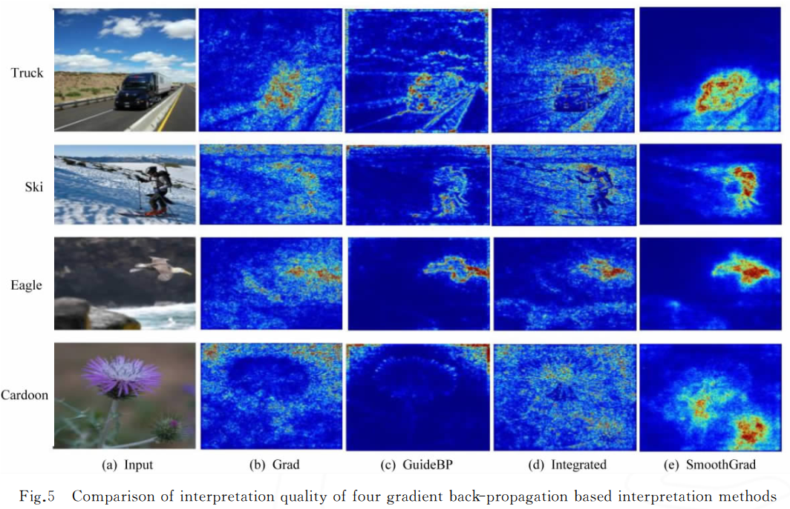
                        - **Smilkov, *SmoothGard***, **平滑梯度的反向传播解释方法**
                            - $\color{green} \text {Smooth grad: Removing noise by adding noise} $
                            - **向输入样本中引入噪声对相似的样本进行采样，对每个采样样本的决策显著图求平均**
                                - **解决**了 **Grad 等**方法中存在的**视觉噪音问题**
                        - **==以上方法无法量化特征对决策结果贡献程度==**
                        - **Landecker, 贡献传播方法**
                            - $\color{green} \text {Interpreting individual classifications of hierarchical networks} $
                            - 首先，**加性模型计算 DNN 高层特征的贡献**
                            - 再用 **BP 将高层的贡献传递到输入**
                        - **Bach, *Layer-wise relevance propagation, LRP***, **分层相关性传播方法**
                            - $\color{green} \text {On pixel-wise explanations for non-linear classifier decisions by layer-wise relevance propagation} $
                            - 计算**单个像素**对图像分类器**预测结果**的**贡献**
                            - **假设分类器**可以被**分解为多个计算层**
                                - **每一层**都可以被建模为**一个多维向量**
                                - 并且**该多维向量**的**每一维**都**对应一个相关性分值**
                            - **BP 将高层的相关性分值递归传播到输入层**
                            - **与 Grad 不同， LRP 方法不要求 DNN 神经元的激活是可微或平滑**
                        - **Shrikumar, *DeepLIFT***
                            - $\color{green} \text {Not just a black box: Learning important features through propagating activation differences} $
                            - 在**输入空间**中**定义参考点**并**参考神经元激活的变化按比例传播相关分数**
                            - 在**不进行数值稳定性修正**的情况下，**原始 LRP** 方法的**输出**结果**等价于 Grad** 方法所求**显著图与输入之间的乘积**
                        - **Ding, *LRP* 应用于基于 AM 的 En-De**
                            - $\color{green} \text {Visualizing and understanding neural machine translation} $
                            - **由于 LRP 方法不要求 DNN 神经元的激活是可微或平滑**
                            - **度量**神经网络中**任意2个神经元**之间关联程度的**相关性**
                            - 有助于理解**汉英翻译**机制并分析错误
                        - **Arras, LRP 引入 NLP**
                            - $\color{green} \text {What is relevant in a text document? : An interpretable machine learning approach} $
                            - **定性并定量证明 LRP** 可用于**文档级别的细粒度分析、跨文档的数据集级别的分析**，以**识别对分类决策重要的单词**
                        - **实现简单、计算效率高**
                        - 如果**预测函数在输入附近变得平坦**，那么**预测函数相对于输入的梯度**在该输入附近将变得**很小**，进而导致**无法利用梯度信息定位样本的决策特征**
                            - **Integrated 一定程度上解决问题，但同时增加计算量，并且引入无法理解的噪音**
                        - **梯度信息只能定位重要特征，无法量化特征贡献度**
                    - **特征反演 (Feature Inversion)**
                        - 利用 **DNN 中间层特征表征，解释整体决策**
                        - **模型级 (model-level)**
                            - $\color{green} \text {Deep inside convolutional networks: Visualising image classification models and saliency maps} $
                            - $\color{green} \text {Understanding deep image representations by inverting them} $
                            - $\color{green} \text {Exploring neural networks with activation atlases} $
                            - $\color{green} \text {Inverting visual representations with convolutional networks} $
                            - 在从**输入空间中**寻找可以**表示** DNN 神经元**所学到的抽象概念的解释原型**
                            - **可视化**和**理解 DNN 每一层特征表示**的方式
                            - **通常难以理解**
                            - 如何从输入样本中**自动化提取**用于模型决策的**重要特征**仍然**困难**
                        - **实例级 (instance-level)**
                            - **输入样本的哪些特征**被用于**激活** DNN 的神经元以**做出特定的决策**
                            - **Du**
                                - $\color{green} \text {Towards explanation of DNN-based prediction with guided feature inversion} $
                                - 执行**导向特征反演过程中加入类别依赖约束**
                                - 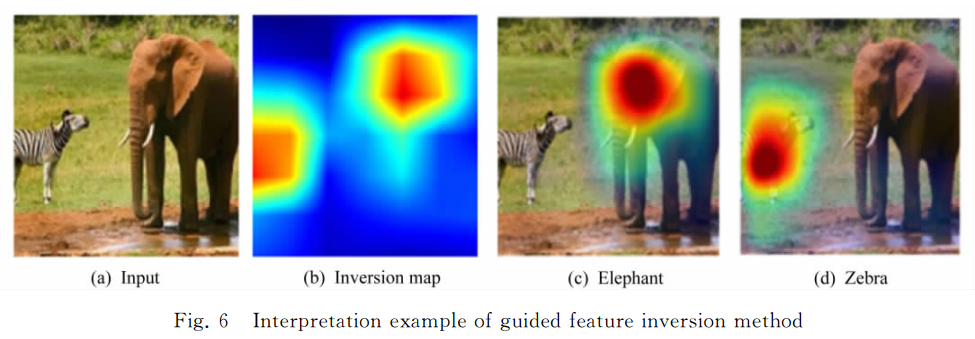
                    - **类激活映射 *(Class Activation Mapping, CAM)***
                        - **CNN 不同层次**的**卷积单元**包含**大量**的**位置信息**
                        - **传统 CNN** 模型通常在**卷积和池化之后采用全连接层**对卷积层提取的特征图进行组合用于最终决策，因而**导致**网络的**定位能力丧失**
                        - **Zhou, *class activation mapping (CAM)*, 类激活映射**, **平均池化代替全连接**
                            - $\color{green} \text {Learning deep features for discriminative localization} $
                            - 用**全局平均池化(global average pooling)代替**传统 CNN 中**除softmax以外的所有全连接层**
                                - **全局平均池化输出 CNN 最后一个卷积层每个单元的特征图的空间平均值**
                                    - 对**空间平均值加权求和得到** CNN 的最终**决策结果**
                                    - **计算加权和得到类激活图**，通过**热力图形式可视化**
                            - **作为正则器防止过拟合**
                            - **保留定位能力保留在网络最后一层**
                            - **需要修改网络结构并重新训练模型**，因而在实际应用中**并不实用**
                        - **Selvaraju, *Grad-CAM*** , **梯度信息结合特征映射的梯度加权类激活映射方法, 特征图局部梯度求平均后作为特征图权重**, **Guided Grad-CAM**, **导向梯度加权类激活映射方法**
                            - $\color{green} \text {Grad-CAM: Visual explanations from deep networks via gradient-based localization} $
                            - ***Grad-CAM***
                                - **计算目标类别相对于最后一个卷积层中每一个特征图的梯度**
                                - **对梯度进行全局平均池化**，以**获得每个特征图的重要性权重**
                                - **基于重要性权重计算特征图的加权激活，获得**一个**粗粒度的梯度加权类激活图，定位输入样本中具有类判别性的重要区域**
                                - 对于**全连接神经网络**，**Grad-CAM 退化为 CAM** 
                                - **相比CAM, Grad-CAM 无需修改网络架构或重训练模型**
                            - **虽然 Grad-CAM 具有良好**的**类别判别能力**并能**很好地定位相关图像区域，但缺乏如 DeconvNet 和 GuidedBP 等像素级别梯度可视化解释方法显示细粒度特征重要性的能力**
                            - ***Guided Grad-CAM***
                                - **为获得更细粒度的特征重要性，结合 Grad-CAM 和 GuidedBP , 提出 Guided Grad-CAM**
                                - **双线性插值将梯度加权类激活图上采样到输入图片分辨率大小**
                                - **点乘 GuidedBP 的输出，得到细粒度的类判别性特征定位图**
                            - **Guided Grad-CAM 效果优于 GuidedBP 和 Grad-CAM**
                                - 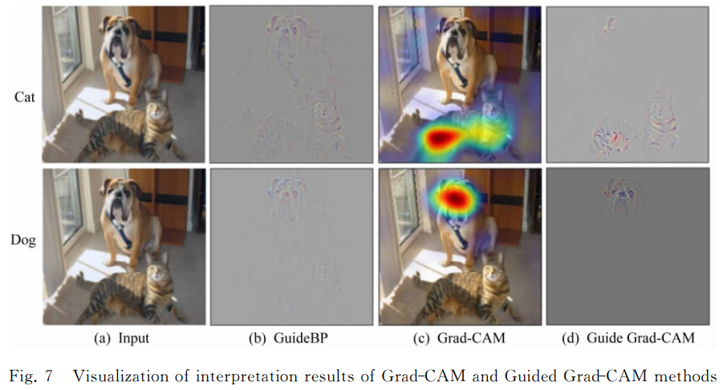
                        - **Chattopadhyay, *Grad-CAM++***
                            - $\color{green} \text {Grad-CAM++: generalized gradient-based visual explanations for deep convolutional networks} $
                            - **梯度图上元素贡献有差异，增加权重二次加权**
                        - 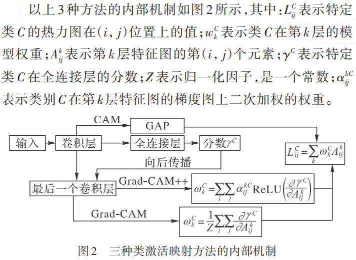
                        - **Wang, *Score-weighted CAM***, **不依赖梯度的权重表示法**
                            - $\color{green} \text {Score-CAM: score-weighted visual explanations for convolutional neural networks} $
                            - **Grad-CAM易于找到错误置信度的样本，即部分权重较低的特征图获得了很高的置信度，而且局部的梯度存在饱和问题，受噪声影响很大**
                            - ***CIC(Channel-wise Increase of Confidence)*** **置信度提升**
                                - **特征图上采样后，与原图像进行点乘，用处理后的图像响应与原图像响应之差表示该特征图的重要性**
                                    - 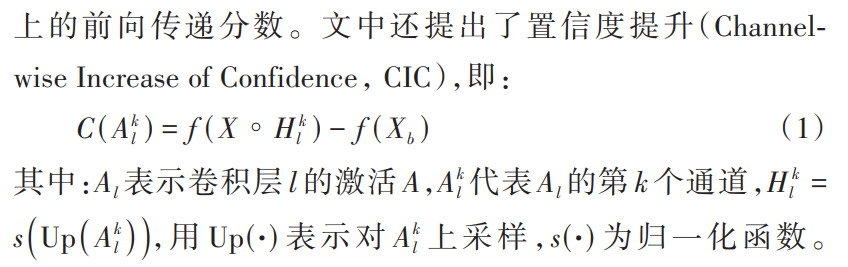
                        - **Desai, *Ablation-CAM***
                            - $\color{green} \text {Ablation-CAM: visual explanations for deep convolutional network via gradient-free localization} $
                            - **Ablation分析**
                            - **遍历地将每层特征图置0再进行网络前向获取目标类别得分，把该值与原始得分的相对大小作为权重**
                        - **实现简单、计算效率高、易于理解**
                        - **CAM 只适合 CNN ，难扩展到全连接神经网络(FCN)和 RNN 等**
                        - **基于类激活映射的可解释性方法通过对特征图分配不同的权重来生成类激活图，实现了区域级的可视化，可以进一步区别分类；但它们关于权重的分配缺乏对应的理论基础**
                        - ***Guided Grad-CAM* 由于引入导向反向传播方法**，同样存在**负梯度归零**导致**无法定位与模型决策结果呈负相关的样本特征**的局限性
                            - $\color{green} \text {Learning important features through propagating activation differences} $
                        - 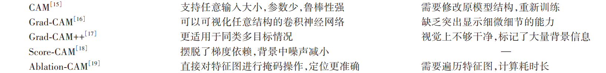
                    - **抽象解释**
                        - **Gehr,** $\boldsymbol{AI^2}$, **可扩展的、可用于验证和分析 DNN 安全性和鲁棒性的抽象解释系统**
                            - $\color{green} \text {Ai2: Safety and robustness certification of neural networks with abstract interpretation} $
                            - **DNN** 的**每一层**处理的是**具体数值**，**抽象元素无法在网络中传播**
                            - **抽象转换器(abstract transformer)将 DNN 每一层转换为对应的抽象层**
                            - 基于**抽象元素过近似(over-approximation)**，**原神经网络每一层**的处理函数以**捕获其真实行为**
                            - **基于抽象转换器返回的抽象结果**，**分析并验证**神经网络的**鲁棒性和安全性**
                            - **不用真正运行 DNN** 模型即可验证 DNN 的某些特定属性，因而**计算效率高**，**可扩展到大规模、更复杂的 DNN 网络**
                            - 但由于采用了**过近似处理**，尽管 $\boldsymbol{AI^2}$ 能提供可靠的解释但**无法保证解释的准确性**
                    - **准确一致解释**
                        - **现有局部解释方法包括抽象解释都很难保证解释结果的准确性和一致性**
                        - **Chu, *OpenBox***, **准确一致的解释方法 ==TODO==**
                            - $\color{green} \text {Exact and consistent interpretation for piecewise linear neural networks: A closed form solution} $
                            - **可为分段线性神经网络(PLNN)家族模型提供精确一致性解释**
                            - **PLNN 在数学上等价于一系列局部线性分类器**
                                - **每一个线性分类器负责分类输入空间中的一组样本**
                            - **线性解释模型**针对每一个输入的决策结果**与待解释 PLNN 的决策结果完全一致**
                                - **解决**了模型的**可解释性与准确性之间的权衡难题**
                            - **只适用于线性神经网络模型，拓展性不强**
        - **隐层可解释化**
            - **Bau, *Network Dissection*. 网络切割**
                - $\color{green} \text {Network dissection: quantifying interpretability of deep visual representations} $
                - **自动标定带有语义的神经元，计算隐层-概念对匹配程度，量化分析不同CNN中神经元语义特征**
                    - **==但是单个神经元不是不包含语义吗？语义存在于整层内，而不是单个神经元？==**
            - **Zhang, 解释图(Explanatory Graph)可视化滤波器**
                - $\color{green} \text {Interpreting CNN knowledge via an explanatory graph} $
                - $\color{green} \text {Extraction of an explanatory graph to interpret a CNN} $
                - **解释图(Explanatory Graph)**
                    - **每个节点严格表示某个子模式**
                    - **每个边表示不同模式的同时激活关系和空间关系**
                    - **将高层卷积层的混乱的知识表达拆分开，具备更好的可迁移性**
            - **Aubry, 用PCA可视化隐层的激活**
                - $\color{green} \text {Understanding deep features with computer-generated imagery} $
            - **Rauber, *t-SNE(t-distributed Stochastic Neighbor Embedding)* t-分布随机近邻嵌入，降维高维数据**
                - $\color{green} \text {Visualizing the hidden activity of artificial neural networks} $
            - **有时隐层并没有特定含义，主观性较强**
        - **基于敏感性分析的可解释性**
            - **敏感性分析 *Sensitivity Analysis***
                - **变量敏感性**
                    - **利用不同的隐层激活函数的偏导数评估输入变量对输出的影响**
                        - $\boldsymbol{20}$
                            - $\color{green} \text {Use of some sensitivity criteria for choosing networks with good generalization ability} $
                        - $\boldsymbol{21}$
                            - $\color{green} \text {Feature selection using a multilayer perceptron} $
                        - $\boldsymbol{22}$
                            - $\color{green} \text {New indices for characterizing spatial models of ore deposits by the use of a sensitivity vector and an influence factor} $
                        - 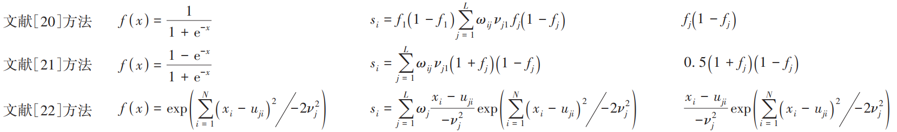
                    - **Dombi, *MIV (Mean Impact Value)*** **平均影响值**
                        - $\color{green} \text {Prediction of rib fracture injury outcome by an artificial neural network} $
                        - **直接变动各个自变量的特征值，并按观测样本数进行平均，得到对应的输出的变化值，其绝对值大小表示变量的重要性程度**
                - **样本敏感性**
                    - **Koh**
                        - $\color{green} \text {Understanding black-box predictions via influence functions} $
                        - **利用影响力函数，刻画了对训练样本施加轻微扰动后特定测试样本损失函数的变化，来理解模型的预测效果**
                    - ***LIME (Local Interpretable Model-sgnostic Explanation)***, **一种与模型无关的局部近似**
                        - $\color{green} \text {“Why should I trust you？”:  explaining the predictions of any classifier} $
                        - **在关注的样本点附近进行轻微扰动后，探测模型的输出发生的变化，根据这种变化在兴趣点附近拟合出一个可解释的简单模型（如线性模型、决策树）**
                    - **Hui, 基于负特征和多数贡献的分解规则**
                        - $\color{green} \text {Deep interpretation with sign separated and contribution recognized decomposition} $
                        - 认为**负贡献可能不等于负相关性，需要在关联分解中分别处理正贡献和负贡献**
                        - **同时提高**网络中**各属性的贡献对**最终网络**决策的敏感性和相关性**
                            - **良好的可解释结果**
                - **把解释性归因于输入特征或者样本，适合解释个体输入，但通常很难从中获得对网络的总体理解**
                    - **==个体输入具有代表性？==**
        - **基于鲁棒性扰动测试的可解释性**
            - **Gowal, *IBP (Interval Bound Propagation)***, **区间定向传播**
                - $\color{green} \text {Scalable verified training for provably robust image classification} $
                - **省略神经网络的最后一层线性层，提高了对单模型结构的验证精度**
                - **并且，由于IBP的计算成本仅相当于网络的两次前向传递，可以执行更广泛的超参数搜索，进而训练大型的神经网络**
            - **Pezeshkpour, 对链路预测模型的对抗性修改**
                - $\color{green} \text {Investigating robustness and interpretability of link prediction via adversarial modifications} $
                - ***CRIAGE (Completion Robustness and Interpretability via Adversarial Graph Edits)***, **对抗性图编辑完成鲁棒性和可解释性**
                - **通过对知识图谱的修改**
                    - **利用对图的删除，可以识别出对预测链接最有影响的事实来研究可解释性**
                    - **利用对图的添加，评估模型的鲁棒性**
            - **Moshkovitz, *BBM-RS, (learning Risk Scores relying on Boost-By-Majority)***, **基于决策树的风险评分算法**
                - $\color{green} \text {Connecting interpretability and robustness in decision trees through separation} $
                - **真实数据是接近线性可分**
                    - **同时使模型具有可解释性和鲁棒性**
                - **利用本身就具有可解释性的风险评分模型，保证生成的分类器在具有较高的分类精度的同时，具有鲁棒性和可解释性**
            - **Koo，探究了第一层的激活函数对模型的可解释性的影响**
                - $\color{green} \text {Improving representations of genomic sequence motifs in convolutional networks with exponential activations} $
                - **发现指数激活函数可以产生鲁棒的表示，而与网络深度无关。**
                - **通过设置 CNN 第一层的激活函数为指数激活**
                    - **可以在激活前抑制背景，只传播有辨识性的信号**
                    - **从而使第一层滤波器具有更好的可解释性，同时显著提高模型的鲁棒性**
            - **Chen, *DDNMF (Deep Denoising Non-negative Matrix Factorization)*** **具有非负约束的深度矩阵分解**
                - $\color{green} \text {A deep non-negative matrix factorization model for big data representation learning} $
                - **用于学习数据的鲁棒可解释的深度学习表示**
                - **包含教师网络和学生网络两个部分，每个网络都包括一个编码器和解码器**
                    - **学生网络**
                        - **编码器和解码器间包括一个非负矩阵分解（Non-negative Matrix Factorization，NMF）模块**
                            - **接受并分解编码后的表示，再通过矩阵乘法恢复表示，以进行后续的解码，为模型带来可解释性**
                    - **教师网络**
                        - **抑制输入数据中的噪声**
                - **通过定义一个可解释的损失，确保知识从教师网络转移到学生网络，增强表示的鲁棒性**
            - **通过对精心设计过的新输入对模型预测的影响程度进行解释，为模型提供了安全保证，但这类举例的方法解释力最低**
        - **基于频率原理的可解释性 ==TODO==**
            - **2018, Xu, F-principle (Frequency principle)**, **频率原理 ==TODO==**
                - $\color{green} \text {Training behavior of deep neural network in frequency domain} $
                    - **在训练过程中，DNN 会先捕获低频分量，同时保持较小的高频分量，之后再缓慢地捕获高频分量**
                    - **因此，对低频占优的目标函数及对象，DNN 往往具有较好的泛化能力；而对于高频占优对象，DNN 则具有较差的表现**
                    - **解释对低频占优的目标函数为什么提前终止训练能防止过拟合**
                - $\color{green} \text {Frequency principle: Fourier analysis sheds light on deep neural networks} $
                    - **从傅里叶分析的角度，解释了训练好的 DNN 在拟合奇偶函数时泛化能力差的原因**
                        - **理论上证明了频率原理是由于激活函数的平滑性导致的**
                        - **并将DNN低频占优的原则和雅可比方法先收敛高频的特性相结合，加快求解泊松方程，为求解微分方程的数值解提供了新思路**
                - $\color{green} \text {Deep frequency principle towards understanding why deeper learning is faster} $
                    - **解释了为什么更深层的前馈神经网络训练更快**
                    - **一个从隐层到输出层的子网络，其等效目标函数由隐层上一层的输出和真实标签构成**
                    - **文中将整个神经网络分成 pre-condition 和 learning 两个部分，并着重分析了 learning 部分的表现**
                        - **发现更深层的神经网络的有效目标函数在训练过程中会更趋近于低频，再基于低频先收敛的 F-principle，为更深的神经网络收敛更快提供了一种可能的解释**
            - **Zhang, *LFP (Linear Frequency Principle)***, **线性频率原理 ==TODO==**
                - $\color{green} \text {A linear frequency principle model to understand the absence of overfitting in neural networks} $
                    - **用一个简单的微分方程刻画了神经网络训练过程中的关键特征**
                    - **只考虑网络参数的一些宏观统计量，忽略了单个参数的具体行为**
                    - **==进而解释了 DNN 在参数极多的情况下依然强大的泛化能力的原因==**
                - $\color{green} \text {Explicitizing an implicit bias of the frequency principle in two-layer neural networks} $
                    - **将频率原理的内隐偏差作为两层神经网络的显式惩罚加以明确**
                    - **准确预测了大宽度的双层 ReLU 神经网络的学习结果**
                    - **给出了泛化误差边界的先验估计**
                    - **==定量理解一般神经网络的学习和泛化==**
            - **Luo，傅里叶分析的理论框架**
                - $\color{green} \text {Theory of the frequency principle for general deep neural networks} $
                - **发现 DNN 的正则性转化为损失函数在频域中的衰减率**
                - **验证了频率原理的通用性**
            - **Wang, 探究了卷积核的平滑性和模型鲁棒性之间的关系**
                - $\color{green} \text {High-frequency component helps explain the generalization of convolutional neural networks} $
                - **CNN 可以利用人类无法感知的图像高频信号**
                - **提出了帮助 CNN 提高对抗鲁棒性的不需要训练或者微调模型的防御方法**
        - **基于信息论的可解释性 ==TODO==**
            - **2000, Tishby, 信息瓶颈理论 ==TODO==**
                - $\color{green} \text {The information bottleneck method} $
                - **将 x 中所有与 y 相关的信息捕获，就可以任意压缩 x 而不丢失预测 y 的能力，即为 x 寻找一个能最大限度地保留 y 信息的短代码**
            - **2015, Tishby, 信息平面**
                - $\color{green} \text {Deep learning and the information bottleneck principle} $
                - **通过层间和输入输出变量之间的互信息来量化网络结构，输入层相对于输出层的相关压缩，层状网络的层次化表示对应于沿信息曲线的结构相变**
            - **Schwartz-Ziv, 信息平面DNN可视化**
                - $\color{green} \text {Opening the black box of deep neural networks via information} $
                - 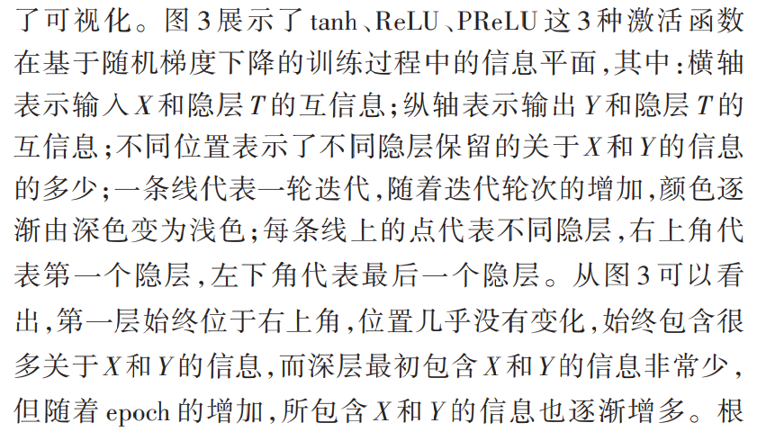
                - 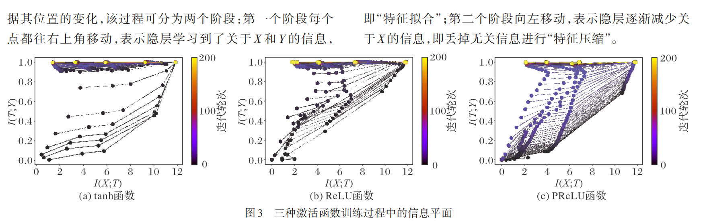
            - **Achille, 参数信息量**
                - $\color{green} \text {Emergence of invariance and disentanglement in deep representations} $
                - **参数数量不能真正衡量神经网络的复杂程度，真正起作用的是网络参数中所含参数的信息量**
                - **权重中的信息来衡量学习模型的复杂性**
                    - **网络表示学习成分的不变性和独立性是由权值中的信息限定的**
            - **Pimentel, 探针作为互信息的估计**
                - $\color{green} \text {Information theoretic probing for linguistic structure } $
                - **控制函数评估探针的有效性并进行了相应解释**
            - **Bang, *VIBI (Variational Information Bottleneck for Interpretation)***, **变分信息瓶颈 ==TODO==**
                - $\color{green} \text {Explaining a black-box by using a deep variational bottleneck approach} $
                - **对于每个实例，解释器返回一个概率，即是否将一个词、短语或句子（NLP）或者一组像素（CV）等特征块作为解释选择，再将选定的特征块作为信息瓶颈来最大限度地压缩输入和输出之间的信息**
                - **系统无关，可解释任何黑箱模型**
            - **更多信息的解释，但泛化到不同网络结构时效果较差**
        - **基于可解释模块的可解释性 ==TODO==**
            - **2017, Sabour, *Capsule***, **胶囊网络**
                - $\color{green} \text {Dynamic routing between capsules} $
                - **胶囊**
                    - **新型神经元**
                        - **输出: 活动向量**
                            - **范数: 置信度**
                            - **方向: 实例化参数**
                    - **输入向量** $\boldsymbol{v_1, v_2}$ **先仿射变换得到** $\boldsymbol{u_1, u_2}$**，再加权和** $\boldsymbol{s=c_1u_1 + c_2u_2}$**，再通过挤压方程(squashing function) 得到输出向量** $\boldsymbol{v=\frac{\parallel  s\parallel^2}{1+\parallel s\parallel^2}\frac s{\parallel s\parallel}}$
                    - **加权和系数**$\boldsymbol{c_1, c_2}$**通过 *Dynamic Routing* 动态路得到**
                        - **能够编码特定语义概念，知道每个胶囊的作用**
            - **2017, Wu, *R-CNN (Region-CNN)***, **可解释的基于候选区域的CNN**
                - $\color{green} \text {Towards interpretable R-CNN by unfolding latent structures} $
                - ***region proposal*, 目标检测的区域建议**
                - ***RoI (Region of Interest)***, **兴趣区域**
                    - **基于RoIPooling算子对边界框建议进行分类和回归**
                - **为了实现弱监督自动化学习，本文用AOG (directed acyclic And-Or-Graph), 有向无环与或图解析算子代替RoIPooling**
                    - **在检测过程中，每个包围框都可以由实时从 AOG派生的最佳解析树进行解释**
            - **2016, Chen, *Info-GAN (Information-maximizing Generative Adversarial Network)***, **基于信息最大化的生成对抗网络**
                - $\color{green} \text {InfoGAN: interpretable representation learning by information maximizing generative adversarial nets} $
                - **完全无监督的方式学习解离化表征的生成对抗网络的信息理论扩展 ==类似反证法 ？==**
                - **改进GAN**
                    - **输入噪声向量分为两部分，最大化可以得到的互信息**
                        - **随机噪声** $\boldsymbol{Z}$
                        - **隐向量** $\boldsymbol{C}$
                    - **要求生成数据和隐向量** $\boldsymbol{C}$ **之间有尽可能多的互信息**
                        - 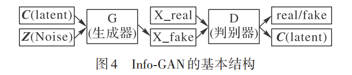
            - **Gu, *GraCapsNets (Graph Capsule Networks)***, **可解释图胶囊网络**
                - $\color{green} \text {Interpretable graph capsule networks for object recognition} $
                - **基于多头注意力的图池化，替换基本路由**
                - **容易解释分类决策**
            - **可以更好地针对目标任务进行解释，但需要网络和解释模块之间的兼容性**
        - **基于优化方法的可解释性**
            - **Daubechies, *ISTA (Iterative Shrinkage Thresholding Algorithm)***, **迭代收缩阈值算法 ==TODO==**
                - $\color{green} \text {An iterative thresholding algorithm for linear inverse problems with a sparsity constraint} $
                - **求解稀疏编码的优化方法**
            - **Zhou, *SC2Net (Sparse Coding to Network)***
                - $\color{green} \text {SC2Net: sparse LSTMs for sparse coding} $
                - **引入新的自适应动量，转化为 RNN , 将对 L1 范数的优化方法与 LSTM 结合起来**
                - **考虑了优化变量更新时每个维度之间的不同和历史信息**
            - **Gregor, *LISTA (Learned ISTA)***, **学习的迭代收缩阈值算法**
                - $\color{green} \text {Learning fast approximations of sparse coding} $
                - **将 ISTA 展开到循环神经网络中**
            - **Liu, *ALISTA (Analytic LISTA)***
                - $\color{green} \text {ALISTA: analytic weights are as good as learned weights in LISTA} $
                - **只留下步长大小和阈值参数的数据驱动学习，大幅简化了训练**
            - **2015, Zhang, *CRF (Conditional Random Field)***, **结合CNN与条件随机场概率图**
                - $\color{green} \text {Conditional random fields as recurrent neural networks} $
                - **条件随机场的求解表示成 RNN 的相关运算**
                    - ***CRF-RNN***
                - **学习CRF参数**
                    - **反向传播、端到端**
                - **图像语义分割上实现突破**
            - **Wang, 深度L0编码器**
                - $\color{green} \text {Learning deep encoders} $
                - **优化对L0范数的稀疏逼近**
                - **基于稳健迭代算法，引入新的神经元和池化函数，构建前向式神经网络**
            - **Zuo, 实现稀疏编码的回复式神经网络**
                - $\color{green} \text {Learning iteration-wise generalized shrinkage-thresholding operators for blind deconvolution} $
                - **针对 *Blind Deconvolution* 盲反卷积**, **推广** $\boldsymbol{l_p}$ **范数最小化的解到** $\boldsymbol{p < 0}$
                - $\boldsymbol{l_p}$ **范数最小化的解**
                    - **即,** ***GST (Generalized Shrinkage-Thresholding)***, **广义阈值收缩算子**
                - **动态地实现显著性边缘选择和时变正则化**
                - **模糊核估计具有更好的鲁棒性**
            - **2017, E, DE 解释 ResNet ==TODO==**
                - $\color{green} \text {A proposal on machine learning via dynamical systems} $
                - **深度神经网络视为离散的动力系统**
            - **Lu, *LM-architecture (Linear Multi-step architecture)***, **线性多步体系结构**
                - $\color{green} \text {Beyond finite layer neural networks: bridging deep architectures and numerical differential equations} $
                - **在任何类似ResNet的网络上使用**
                - **具有更高的精度**
            - **2018, Chen, *ODENet***
                - $\color{green} \text {Neural ordinary differential equations} $
                - **将神经网络对隐藏状态的导数进行参数化，不需要再分层传播梯度与更新参数，大幅降低了存储成本**
                - **网络的输出通过计算常微分方程得到**
            - **2019, Grathwohl, *FFJORD (Free-From Jacobian Of Reversible Dyanamics)***, **可逆动力学自由形式的雅可比矩阵**
                - $\color{green} \text {FFJORD: free-form continuous dynamics for scalable reversible generative models} $
                - **降低算法复杂性**
            - **2009, Lin, 基于 PDE 的神经网络模型**
                - $\color{green} \text {Designing partial differential equations for image processing by combining differential invariants} $
            - **2017, Haber, PDE 解释 ResNet 等**
                - $\color{green} \text {Stable architectures for deep neural networks} $
            - **2020, Ruthotto, 基于拉格朗日乘子法的前向传播算法**
                - $\color{green} \text {Deep neural networks motivated by partial differential equations} $
                -  **PDE 约束优化中模型参数的正则化可以转化为神经网络输出的正则化**
                - **模型在较少标签的情况下也具有较高的预测精度**
            - **对目标任务更强的解释性, 但受限于优化方法本身缺陷, 如稳定性、计算复杂**
        - 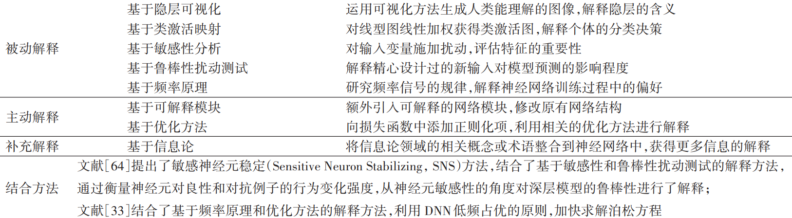
    - **应用**
        - **2019, Guo, *LEMNA (Local Explanation Method using Nonlinear Approximation)***, **非线性近似的局部解释方法**
            - $\color{green} \text {Explain the application of deep learning to network security with LEMNA} $
            - **引入 *Fused Lasso* 处理特征间的依赖关系, 融入到一个混合线性模型中拟合局部非线性的决策边界**
        - ***TEM (Tree-enhanced Embedding Method)***, **树增强嵌入方法**
            - $\color{green} \text {TEM: tree-enhanced embedding model for explainable recommendation} $
            - **首先利用树模型学习显式的决策规则（交叉特征），然后使用嵌入模型合并交叉特征进行预测**
            - **引入嵌入技术和注意力机制代替原本的全连接层**
        - ***MacridVAE (Macro-micro Disentangled Variational Auto-Encoder)***, **非纠缠表示的宏观-微观解离化VAE**
            - $\color{green} \text {Learning disentangled representations for recommendation} $
            - **微解离通过 VAE 对信息进行理论解释，使每个维度可以独立反映一个低层次因素**
        - **2021, Ye, 基于 *XGBoost* 和注意机制的可解释推荐模型**
            - $\color{green} \text {An interpretable mechanism for personalized recommendation based on cross feature} $
            - **XGBoost ==TODO==**
            - **模型预测的自解释**
        - **2018, Biffi, 三维VAE**
            - $\color{green} \text {Learning interpretable anatomical features through deep generative models: application to cardiac remodeling} $
            - **从 3D 分割中学习到的可解释的任务相关解剖学模式(Anatomic Pattern)**
        - **2020, Schaumberg, 可解释的深度学习模型 ==TODO==**
            - $\color{green} \text {Interpretable multimodal deep learning for real-time pan-tissue pan-disease pathology search on social media} $
        - **2020, Wang, *scCapsNet (single-cell Capsule Networks)***, **使用胶囊网络的可解释深度学习架构**
            - $\color{green} \text {An interpretable deep-learning architecture of capsule networks for identifying cell-type gene expression programs from single-cell RNA-sequencing data} $
            - **识别竞争性单细胞类型，执行特征选择，进而识别编码不同类型亚细胞的基因组**
        - **2021, Pintelas, 可解释的图像分类框架 ==TODO==**
            - $\color{green} \text {A novel explainable image classification framework: case study on skin cancer and plant disease prediction} $
            - **皮肤癌的预测问题**
        - **数据挖掘**
            - ***KDD***
                - $\color{green} \text {A study on different classification models for knowledge discovery} $
                - $\color{green} \text {Data mining and knowledge discovery in predictive toxicology} $
                - $\color{green} \text {Investigating and reflecting on the integration of automatic data analysis and visualization in knowledge discovery} $
                - $\color{green} \text {From data mining to knowledge discovery in databases} $
        - **对抗攻击**
            - **白盒对抗攻击**
                - $\color{green} \text {Adversarial CAPTCHAs} $
                    - **已知目标模型的结构、参数信息，利用反向传播解释方法可探测模型的弱点**
                - **Goodfellow, *FGSM***, **快速梯度符号攻击方法**
                    - $\color{green} \text {Explaining and harnessing adversarial examples} $
                    - **输出相对于输入**样本的**梯度**信息来**探测**模型的**敏感性**
                    - **朝着敏感方向添加一个固定规模**的**噪音**来**生成对抗样本**
                - **Papernot, *JSMA***, **雅可比显著图攻击**
                    - $\color{green} \text {The limitations of deep learning in adversarial settings} $
                    - 利用 **Grad** 解释方法**生成显著图**，**选择最重要的特征进行攻击**
                    - **只需要扰动少量的特征**就能达到**很高的攻击成功率**，**隐蔽性更强**
            - **黑盒对抗攻击**
                - $\color{green} \text {Adversarial examples versus cloud-based detectors: A black-box empirical study} $
                    - 由于**无法获取**模型的**结构信息**，**只能操纵**模型的**输入和输出**
                - **Papernot, 针对黑盒机器学习模型的替代模型攻击方法**
                    - $\color{green} \text {Practical black-box attacks against machine learning} $
                    - **模型蒸馏**训练一个**替代模型拟合**目标黑盒模型的决策结果
                    - 已有的攻击方法**针对替代模型生成对抗样本**
                    - 利用**生成的对抗样本**对黑盒模型进行**迁移攻击**
                - **Li, *TextBugger***, **基于敏感性分析解释方法的文本对抗攻击方法**
                    - $\color{green} \text {TextBugger: Generating adversarial text against real-world applications} $
                    - **定位文本中的重要单词**，利用符合人类感知的**噪音逐个扰动重要的单词直到达到攻击目标**
    - **现存问题**
        - **自身脆弱性**
            - 由于**近似处理或基于优化手段**，大多数**解释方法**只能提供**近似的解释**，因而**解释结果**与模型的**真实行为**之间存在一定的**不一致性**
            - **利用不一致性**设计**针对可解释**系统的**新型对抗样本攻击**
            - **攻击目的**
                - **不改变**模型的**决策结果**，**使解释方法解释出错**
                    - **Ghorbani, 模型解释脆弱性**
                        - $\color{green} \text {Interpretation of neural networks is fragile} $
                        - $\boldsymbol{\begin{aligned}\arg\max_{\delta}D\left(I(x_{t};N),I(x_{t}+\delta;N)\right)\\\mathrm{s.t.}\parallel\delta\parallel_{\infty}\leqslant\varepsilon,f(x_{t}+\delta)=f(x_{t}) \end{aligned}}$ 
                            - $\boldsymbol{I\left(x_{_{t}};N\right)}$ 
                                - **解释系统对神经网络** $\boldsymbol{N}$ **针对样本** $\boldsymbol{x_t}$ **决策结果** $\boldsymbol{f(x_t)}$ **的解释**
                            - $\boldsymbol{\delta}$
                                - **样本**中**所需**添加的**扰动**
                            - $\boldsymbol{D\left(\bullet\right)}$ 
                                - **度量扰动前后解释结果的变化**
                        - ***Grad***, ***Integrated***, ***DeepLIFT*** **等反向传播解释方法**，均**易受到对抗样本攻击**，**只能提供脆弱的模型解释**
                - **不改变解释方法的解释结果**，**使模型决策出错**
                    - **Zhang, *Acid* 攻击**
                        - $\color{green} \text {Interpretable deep learning under fire} $
                        - **生成欺骗分类器及其解释方法**的对抗样本实际上**并不比生成仅能欺骗分类器的对抗样本更困难**
                            - **同样是脆弱的**
                                - **表示导向(激活最大化、特征反演等)**
                                - **模型导向(如基于掩码模型的显著性检测等)**
                                - **扰动导向(如敏感性分析等)**
                        - 并且**使基于对比攻击前后解释结果的防御方法失效**
            - **消除解释方法与决策系统之间的不一致性**则是**提高**解释方法**鲁棒性**进而消除其外在安全隐患的**重要途径**
        - **==精确解释方法设计==**
            - **挑战: 消除模型准确性与可解释性之间的制约**
            - ***ante-hoc***
                - **可能路径**
                    - **结合机器学习与因果模型**
                    - **结合机器学习与常识推理和类比计算等技术，形成可解释的、能自动推理的学习系统**
            - ***post-hoc***
                - **可能路径**
                    - **==设计数学上与待解释模型等价的解释方法或解释模型==**
        - **解释方法评估**
            - ***ante-hoc***
                - **挑战: 如何量化模型的内在解释能力**
            - ***post-hoc***
                - **挑战: 如何量化解释结果的保真度和一致性**
                - **Guo, *RMSE***, **解释方法**给出的**预测结果**与**待解释**模型**预测结果**之间的**均方根误差**评估解释方法的**保真度**
                    - $\color{green} \text {Lemna: Explaining deep learning based security applications} $
                    - **无法用于**评估激活最大化、敏感性分析、反向传播以及特征反演等**不提供预测结果的解释方法**
                - **Chu, 输入样本及其邻近样本**的**解释结果的余弦相似性**来评估解释方法，**无法**用于**评估解释结果**的**保真度**
                    - $\color{green} \text {Exact and consistent interpretation for piecewise linear neural networks: A closed form solution} $
                - **仍然缺乏**用于评估针对**同一模型**的**不同解释方法的定量评估指标**