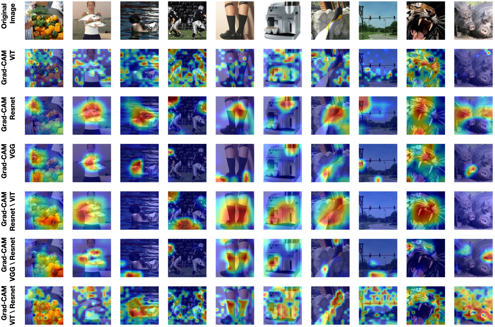

# On the Versatile Uses of Partial Distance Correlation in Deep Learning - Informative Comparisons between Networks (Partial Distance Correlation) Implementation

## Quantitive Results
Remove model Y from model X, and compute the correlation between the residual and the ground truth label embedding.


| Network $\Theta_X$ |  Network $\Theta_Y$ | $\mathcal{R}^2(X, GT)$ | $\mathcal{R}^2(Y, GT)$ | $\mathcal{R}^2(X\|Y, GT)$ | $\mathcal{R}^2((Y\|X), GT)$
|:---:|:---:|:---:|:---:|:---:|:---:|
| ViT$^1$     |  Resnet 18$^2$   |  0.042     |  0.025    |  0.035       |  0.007 |
| ViT         |  Resnet 50$^3$   |  0.043     |  0.036    |  0.028       |  0.017 |
| ViT         |  Resnet 152$^4$  |  0.044     |  0.020    |  0.040       |  0.009 |
| ViT         |  VGG 19 BN$^5$  |  0.042     |  0.037    |  0.026       |  0.015 |
| ViT         |  Densenet121$^6$ |  0.043     |  0.026    |  0.035       |  0.007 |
| ViT large$^7$   |  Resnet 18   |  0.046     |  0.027    |  0.038       |  0.007 |
| ViT large   |  Resnet 50   |  0.046     |  0.037    |  0.031       |  0.016 |
| ViT large   |  Resnet 152  |  0.046     |  0.021    |  0.042       |  0.010 |
| ViT large   |  ViT         |  0.045     |  0.043    |  0.019       |  0.013 |
| ViT+Resnet 50$^8$ |  Resnet 18  |  0.044     |  0.024    |  0.037       |  0.005 |
| Resnet 152  |  Resnet 18   |  0.019     |  0.025    |  0.013       |  0.020 |
| Resnet 152  |  Resnet 50   |  0.021     |  0.037    |  0.003       |  0.030 |
| Resnet 50   |  Resnet 18   |  0.036     |  0.025    |  0.027       |  0.008 |
| Resnet 50   |  VGG 19 BN   |  0.036     |  0.036    |  0.020       |  0.019| 

*Note Accuracy: 1. 84.40%; 2. 69.76%; 3. 79.02%; 4. 82.54%; 5. 74.22%; 6. 75.57%; 7. 85.68%; 8. 84.13%*

## Qualititive Results


## Training
### Measure pretrained model
To measure the pretrained model, such as whether ViT is better than Resnet regarding to the correlation with the ground truth labels, run the following commands with modification of modelX and modelY to be the pretrained model that we want to verify,

```
python main_pDC_models.py --batch_size 128
```

### Measure similarity
To measure the similarity between layers, run the following
```
python main_similarity.py --batch_size 128 --PATH ./ViT_resnet34 --total_time 3600.0
```
PATH is where the results will be stored. Total time reflects the total available running time, so that we do not need to cover the entire ImageNet dataset to get the results.

And then, we should modify the code within ```main_similarity.py``` so that the modelX and modelY are the ones that we want to further test.

After having all the results in hand,
```
python show_heat_map.py
```
will show all the similarity results.

### Train GradCAM with Partial Distance Correlation
First we will need to train the modelX (in this case, ViT) from the pretrained checkpoint, to incorporate the partial distance correlation loss.
```
python main.py --batch_size 128 --lr 1e-5
```
Then, after having the trained model, we will use the following code to visulize.
```
python main_CAM.py
```


