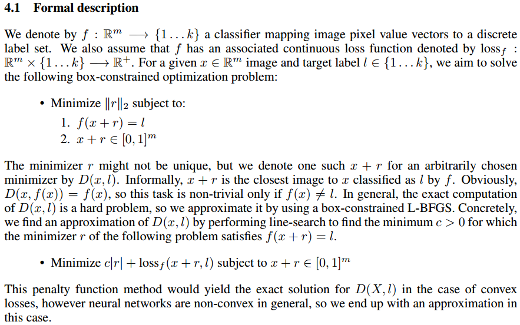
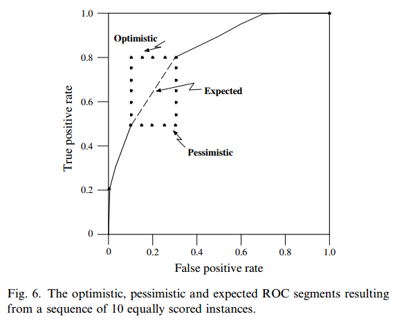

# **$\color{green} \text {Revealing the Distributional Vulnerability of Discriminators by Implicit Generators} $**

$\color{green} \text {} $

## **1.pre-knowledge**

- ***Independent and identically distributed* (IID)** assumption
  - **training** and **test** samples from **same distribution**  ***(in-distribution (ID))***
  
  - **not** hold as **always**
    - ***distributional vulnerability*** of DNNs
    - may make **high-confidence** predictions on ***out-of distribution* (OOD)** test samples 
      - $\color{green} \text {Deep Neural Networks are Easily Fooled: High Confidence Predictions for Unrecognizable Images} $
        - ***RELATED***
          - $\color{green} \text {Deep Residual Learning for Image Recognition} $
            - **ResNet**
        - $\color{green} \text {Fooling Examples: Another Intriguing Property of Neural Networks} $
        - $\color{green} \text {Intriguing properties of neural networks} $
          - **semantic information**
            - **Previous**
              - finding the set of **inputs that maximally activate** a **given unit**
                - $\color{green} \text {Rich feature hierarchies for accurate object detection and semantic segmentation} $
                  - ```http://www.cs.berkeley.edu/˜rbg/rcnn```
                - $\color{green} \text {Measuring invariances in deep networks} $
                - $\color{green} \text {Visualizing and Understanding Convolutional Networks} $
              - **last feature layer form** a **distinguished basis** which is particularly useful for **extracting semantic information**
            - **random projections**
              - **entire space** of activations, **rather than** the **individual units**, that **contains** the **bulk** of the **semantic information**
              - **vector representations** are **stable** up **to** a **rotation of** the **space**, **so** the **individual units** of the vector representations are **unlikely** to **contain semantic information**
                - 
              - ==**人眼认为相似图片在计算机中可能差别巨大，但是本实验进行随机向量的投影后只是人眼看起来相似，但是并不能证明在计算机中随机向量投影后对结果影响不大（不影响分类）？**==
              - ==**对于人类能理解的解释性和神经网络本身的解释，标准并不统一？**==
          - **Adversarial examples**
            - **Box-constrained L-BFGS**
              - ==**TODO**==
                - 
            - have **Cross model generalization** and **Cross training-set generalization**
            - **frequency of adversarial negatives appearance**
              - ==**TODO**==
            - **Spectral Analysis of Unstability**
              - **Upper Lipschitz Bounds**
                - **large** bounds do **not** automatically translate into **existence of adversarial examples**
                - **small** bounds **guarantee** that **no** such examples can **appear**
                - **penalizing** each **upper Lipschitz bound**, which **might** help **improve** the **generalisation error** of the **networks**.
              - ==**TODO**==
                - ")
                - ")
                - ")
        - $\color{green} \text {Explaining and Harnessing Adversarial Examples} $
          - **Linear Explanation of Adversarial Examples**
            - **limited input feature precision**
            - **expect** the classifier to assign the **same class** to $\boldsymbol{x}$ **and** $\boldsymbol{\widetilde{x} = x + \eta}$ as long as $\boldsymbol{\parallel \eta \parallel _{\infty} < \epsilon}$
            - assign $\boldsymbol{\eta = sign(w)}$ to **max** activation **growth** $\boldsymbol{w^{\top}\eta}$
            - $\boldsymbol{w^{\top}\eta \leq \epsilon mn}$
              - **grow linearly with n**
              - $\boldsymbol{n}$**: dimension** of $\boldsymbol{w}$
              - $\boldsymbol{m}$**: average magnitude** of an **element** of the **weight vector**
          - **Linear Perturbation of Non-Linear Models**
            - ***Fast Gradient Sign Method* (FGSM)**
              - **generate adversarial examples**
              - $\boldsymbol{\eta = \epsilon sign(\nabla_{x} J(\theta,x,y))}$
                - $\boldsymbol{x}$**: input**
                - $\boldsymbol{y}$**: label**
                - $\boldsymbol{\theta}$**: parameters**
                - $\boldsymbol{J}$**: cost function**
              -  **linearize** the **cost function, obtaining** an **optimal max-norm constrained pertubation ($\boldsymbol{\parallel \eta \parallel _{\infty} < \epsilon}$)**
              - 
          - **Adversarial Training**
            - **Linear Models**
              - **Logistic Regression**
                - $\boldsymbol{y \in \{-1,1\}}$
                - $\boldsymbol{P(y=1) = \sigma(w^{\top}x + b)}$
                  - $\boldsymbol{\sigma(x) = \frac{1}{1+e^{-x}}}$ &nbsp;&nbsp;&nbsp;&nbsp; ***(Sigmoid function)***
                - **cost function**
                  - $\boldsymbol{\Epsilon_{x,y \sim p_{data}} \zeta[-y(w^{\top}x + b)]}$
                    - $\boldsymbol{\zeta(x) = log(1 + e^{x})}$ &nbsp;&nbsp;&nbsp;&nbsp; ***(Softplus function)***
                    - $\boldsymbol{\zeta' (x) = \sigma(x)}$
                  - **replace** $\boldsymbol{x}$ with $\boldsymbol{\widetilde{x}}$
                    - **sign of the gradient**
                      - $\boldsymbol{-sign(w)}$
                    - $\boldsymbol{w^{\top}sign(w) = \parallel w \parallel_{1}}$
                    - **min** $\boldsymbol{\Epsilon_{x,y \sim p_{data}} \zeta[-y(w^{\top}\widetilde{x} + b)] \underbrace{ = }_{\widetilde{x} = x + \eta , \eta = \epsilon - sign(w)} }$ **min** $\boldsymbol{\Epsilon_{x,y \sim p_{data}} \zeta[y(\epsilon \parallel w \parallel_{1} - w^{\top}x - b)]}$
                      - **similar** to $\boldsymbol{L^{1}}$ **Regularization, but different**
                      - **hard to find** $\boldsymbol{\eta}$ **in multiclass softmax regression**
                - 
            - **Deep Networks**
              - **Universal Approximator Theorem**
                - $\color{green} \text {Multilayer feedforward networks are universal approximators} $
                - a **neural network** with **at least one hidden layer** can **represent any function** to an **arbitary degree of accuracy** so long as its **hidden layer** is permitted to **have enough units**
                - **not guarantee** that it will be **able** to discover **a function** with **all** of the **desired properties**
              - **adversarial objective function ased on FGSM**
                - **Motivation**
                  - **Inputs mixed** into **adversarial samples** are **unlikely** to **occur naturally**
                  - **L-BFGS extensively generates adversarial sample** is **too expensive**
                - $\boldsymbol{\widetilde{J}(\theta,x,y) = \alpha J(\theta,x,y) + (1-\alpha)J(\theta, x + \epsilon sign(\nabla_{x} J(\theta,x,y)))}$
                  - **In this paper,** $\boldsymbol{\alpha = 0.5}$
                - **an effective regularizer**
        - **Test Models**
          - ***ImageNet DNN* (AlexNet)**
            - $\color{green} \text {ImageNet classification with deep convolutional neural networks} $
          - ***MNIST DNN* (LeNet)**
        - ```http://EvolvingAI.org/fooling```
        -  **discriminative DNN** model
        -  **visualize** **features** learned by **DNNs**
           -  **CPPN-encoded EA**
        -  **Reason**
           -  **Two** different ways of **encoding evolutionary algorithms**
           -   **gradient ascent**
           -   ==**mathematical proof?**==
      - $\color{green} \text {Generalized Out-of-Distribution Detection: A Survey} $
        - **generalized OOD detection**
          - 
          - 
          - ***anomaly detection* (AD)**
            - treats **ID samples** as **a whole**, **not require** the **differentiation**
              - **Sensory AD**
                - **detects test samples** with **covariate shift**
                - **No semantic shift**
                - **Single / Multi-Class**
                - most popular **academic sensory AD benchmark**
                  - **MVTec-AD**
                    - $\color{green} \text {MVTec-AD A Comprehensive Real-World Dataset for Unsupervised Anomaly Detection} $
              -  **Semantic AD**
                 - **detects test samples** with **label shift (semantic shift)**
                 - **Single class**
                 - An **example** of the **academic benchmarks** is to recursively use **one class** from **MNIST** **as ID** during **training**, and ask the model to **distinguish** it from the **rest of the 9 classes** during **testing**
                 - $\color{green} \text {Detecting Semantic Anomalies} $
          - ***novelty detection* (ND)**
          - ***open set recognition* (OSR)**
          - ***outlier detection* (OD)**
          - ***Out-of-distribution* (OOD) detection**
          - **Evaluation**
             - **true normalities** as **positive** and **anomalies** as **negative**
             - ***area under the receiver operating characteristic curve* (AUROC)**
               - $\color{green} \text {An introduction to roc analysis} $
                  - 
                 - **ture positive rate = hit rate = recall = sensitivity**
                 - $\boldsymbol{specificity =  \frac{TN}{FP + TN}}$
                 - **positive predictive value = precision**
                 - **ROC space**
                   - **point (fp rate, tp rate)** 
                     - **(0, 0)**
                       - **never issuing** a **positive classification**
                       - **no false positive errors, also no true positives**
                     - **(1, 1)**
                       - **unconditionally issuing positive classifications**
                     - **(0, 1)**
                       - **perfect classification**
                     - **closer to (0, 1), better**
                     - **close to (0, 0), conservative**
                       - **few false positive errors, but low true positive rates**
                     - **close to (1, 1), liberal**
                       - classify **nearly all positives correctly, but** have **high false positive rates**
                         - 
                   - **Curve**
                     - **step function (**generated from a **finite set** of instances **)**
                     - **highest accuracy (70%) at (0.1, 0.5)**
                     - **best accuracy** occurs at a **threshold** of **$\geqslant$ 0.54, not $\geqslant$ 0.5**
                       - 
                     - ***Relative* versus *absolute scores*** 
                       - **classifier need only** produce **relative accurate scores** that serve to **discriminate** **positive and negative instances**
                       - **classifier scores** **should not** be **compared across model classes *(different score intervals)***
                     - **insensitive** to **changes** in **class distribution**
                     - **ROC Curve not change with a shifted distribution**
                       - 
                     - **Generate**
                       - 
                         - **Expected line** is the **average** of the **pessimistic and optimistic** segments
                         - **not emitting** an ROC **point until all** instances of **equal f-values** have been **processed**
                           - 
                       - ==**If** such **instances** are **not averaged**, the resulting **ROC curves** will be **sensitive** to the **test set ordering** **(why?)==**
                   - **Advantage**
                     - visualizing and organizing **classifier performance** **without** regard to **class distributions or ==error costs?==**
                   -  ***ROC convex hull* (ROCCH)**
                      -  $\color{green} \text {Robust Classification for Imprecise Environments} $
                      -  $\color{green} \text {} $
                      - ***iso-performance line*** 
                        - **points on** a line of **slope m** have the **same expected cost**
                          - 
                      - **only** the **classifiers** on the **convex hull** are **potentially optimal**, **others** **don't need** be **retained**
                        -  m_alpha = 10 ; m_beta = 0.1")
                      - **northwest line** and **tangent** to **classifier**
                        - **best classifier (condition)**
                      - $\color{green} \text {ROC convex hull and nonparametric maximum likelihood estimation} $
                   - ***Area under an ROC curve* (AUC)**
                     - **probability** that the **classifier** will **rank** a **randomly chosen** **positive instance** **higher** than a randomly chosen **negative instance**.
                     - **equivalent** to **Wilcoxon test of ranks**
                     - $\boldsymbol{Gini + 1 = 2 \cdot AUC}$
                     - **greater AUC , better average performance**
                       - **specific region, high-AUC perform worse**
                     - 
                     - **Calculate AUC**
                       -  **Instead** of **collecting ROC points**, the algorithm **adds** **successive areas of trapezoids to A**
                         - 
                    -  **Averaging ROC curves**
                       -  **Without** a measure of **variance** we **cannot compare** the **classifiers**
                       -  **vertical averaging**
                          -  **fixed FP rates, averages the corresponding TP rates**
                          -  **advantage**
                             -  **tp rate** is a **single dependent variable**, the **simplifies computing confidence intervals**
                          -  **limitation**
                             -  **fp rate**, is **often not under** the **direct control** of the researcher
                          -  
                       -  **threshold averaging**
                          -  **for each threshold** it finds the **corresponding point** of each ROC curve and **averages** them
                          -  **limitation**
                             -  **classifier score** assigned **to each point**
                             -  **classifier scores** **should not** be **compared across model** 
                                -  **classes scores** **may** be **incommensurate**
                    -  **Multi-class domains** ==**(TODO)**==
                       - **Multi-class ROC graphs**
                         -  $\color{green} \text {Note on the location of optimal classifiers in n-dimensional ROC space} $
                         -  $\color{green} \text {Extensions of ROC analysis to multi-class domains} $
                         -  **One method**
                            - produce **n different ROC graphs (for each class)**
                            - 
                            - **limitation**
                              - each **$ N_i $** **comprises** the union of **$ n - 1 $ classes , changes in prevalence** within these classes **may alter** the **$ c_i's $ ROC graph**
                                - they are **insensitive** to **class skew**
                       - **Multi-class AUC**
                         - **One approach**
                           - $\color{green} \text {A Simple Generalisation of the Area Under the ROC Curve for Multiple Class Classification Problems} $
                           - 
                           - **limitation**
                             - **class reference ROC** is **sensitive** to **class distributions** and **error costs**
                         - **Improvement**
                           - $\color{green} \text {Well-trained PETs: Improving probability estimation trees} $
                           - a measure that is **insensitive** to **class distribution**and **error costs**
                           - **summation** is **irrespective** of **order**
                             - 
                           - **limitation**
                             - **no easy** way to **visualize** the **surface** whose **area** is **being calculated**
                     - **Interpolating classifiers** ==**(TODO)**==
                       - **desired** performance of classifier lies **between** **two available classifiers**
                       - **sampling** the **decisions** of **each classifier**
                       - 
               -  $\color{green} \text {ROC analysis of classifiers in machine learning: A survey} $
             - Metrics of **F-scores** and the ***area under the precision-recall curve* (AUPR)**
               - $\color{green} \text {Evaluation: from precision, recall and f-measure to roc, informedness, markedness and correlation} $
             - **Cost Curve (unequal cost)** ==**(TODO)**==
                 
           - $\color{green} \text {Understanding Failures in Out-of-Distribution Detection with Deep Generative Models} $
        - **distributional shifts**
          - **Semantic Shift**
            - **focal** point **of OOD detection**
            - **label space** Y can be **different** between ID and OOD data
            - $\color{green} \text {A baseline for detecting misclassified and out-of-distribution examples in neural networks} $
              - **==OOD samples are drawn from different classes==**
            
          - **Covariate Shift**
            - **evaluate** model **generalization** and **robustness** performance
            - **label space** Y remains the **same** during **test** time
            - $\color{green} \text {A theory of learning from different domains} $
            - $\color{green} \text {Deeper, broader and artier domain generalization} $
            - $\color{green} \text {Deep visual domain adaptation: A survey} $
          - 


$\color{green} \text {} $
